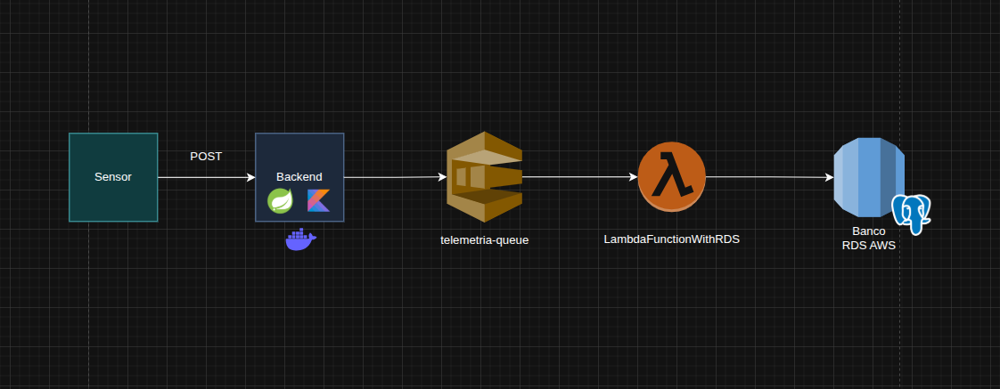

# Sistema de Telemetria

Link da documentação no docusaurus: https://iisabelledantas.github.io/PonderadaLista/

## Visão Geral

O sistema recebe dados de sensores IoT via API REST, processa as mensagens de forma assíncrona utilizando o Amazon SQS e persiste os dados em um banco PostgreSQL hospedado no Amazon RDS. O fluxo completo é:

```
Sensor → POST /api/telemetria/dados → Backend → SQS → Lambda → RDS PostgreSQL
```

---

## Arquitetura

<div style="display: flex; align-items: center; gap: 8px;">
  
</div>

| Componente | Tecnologia | Responsabilidade |
|---|---|---|
| Backend | Spring Boot + Kotlin | Recebe dados via REST e enfileira no SQS |
| Fila | Amazon SQS | Desacopla backend e Lambda |
| Processador | AWS Lambda (Java 21) | Consome a fila e persiste no banco |
| Banco | Amazon RDS PostgreSQL | Armazena os dados de telemetria |
| Containerização | Docker + LocalStack | Ambiente local reproduzível |

---

## Tecnologias

- **Kotlin 1.9.25** + **Spring Boot 3.5.11**
- **AWS SDK** (SQS, Lambda, RDS)
- **JDBC** (conexão direta com PostgreSQL)
- **Docker** + **Docker Compose**
- **LocalStack** (simulação local da AWS)
- **JUnit 5** + **Mockito** (testes unitários)
- **k6** + **Grafana** (testes de carga)

---

## Pré-requisitos

- JDK 21
- Docker e Docker Compose instalados
- AWS CLI configurado com credenciais válidas
- k6 instalado (para testes de carga)
- Conta AWS com permissões para SQS, Lambda, RDS, S3 e IAM

## Como Fazer Deploy na AWS

### Pré-requisitos AWS

- Fila SQS criada (`telemetria-queue`)
- Instância RDS PostgreSQL criada e acessível
- Bucket S3 para armazenar o JAR da Lambda
- Role IAM com permissões para Lambda, SQS e RDS

### 1. Crie a tabela no RDS

Conecte ao banco via CloudShell ou psql e execute:

```sql
CREATE TABLE sensor_data (
    id          SERIAL PRIMARY KEY,
    sensor_id   VARCHAR(255) NOT NULL,
    temperatura DOUBLE PRECISION NOT NULL,
    umidade     DOUBLE PRECISION NOT NULL,
    timestamp   VARCHAR(255) NOT NULL
);
```

### 2. Gere o Shadow JAR para a Lambda

```bash
./gradlew shadowJar
```

O arquivo será gerado em `build/libs/telemetria-0.0.1-SNAPSHOT-all.jar`.

### 3. Faça o upload do JAR para o S3

```bash
aws s3 cp build/libs/telemetria-0.0.1-SNAPSHOT-all.jar s3://seu-bucket/telemetria-0.0.1-SNAPSHOT-all.jar
```

### 4. Configure a Lambda

- **Runtime:** Java 21
- **Handler:** `com.inteli.telemetria.messaging.consumer.TelemetriaConsumer::handleRequest`
- **Timeout:** 1 minuto
- **Memória:** 128 MB
- **Código:** upload via S3 (URL do arquivo acima)

### 5. Configure as variáveis de ambiente da Lambda

No console da AWS em **Lambda > Configuration > Environment variables**:

| Variável | Valor |
|---|---|
| `RDS_ENDPOINT` | endpoint do seu RDS |
| `RDS_USUARIO` | usuário do banco |
| `RDS_SENHA` | senha do banco |
| `RDS_DBNAME` | nome do banco |

### 6. Configure o trigger SQS

- Em **Lambda > Configuration > Triggers**, adicione a fila SQS como trigger

### 7. Configure o Backend para produção

No `application.properties`, atualize as variáveis com os valores reais da AWS:

```properties
spring.cloud.aws.credentials.access-key=sua-access-key
spring.cloud.aws.credentials.secret-key=sua-secret-key
spring.cloud.aws.region.static=sa-east-1
spring.cloud.aws.sqs.endpoint=https://sqs.sa-east-1.amazonaws.com/seu-id/telemetria-queue
```

---

## 🧪 Como Rodar os Testes

### Testes Unitários

```bash
./gradlew test
```

Os testes cobrem as seguintes classes:

| Classe | Testes |
|---|---|
| `TelemetriaProcessorTest` | Processamento de mensagem válida, inválida e verificação do INSERT |
| `TelemetriaControllerTest` | Status 200, chamada ao SqsService e erro de serialização |
| `SqsServiceTest` | Chamada ao SqsClient e propagação de exceção |


### Testes de Carga (k6)

Certifique-se de que o backend está rodando antes de executar:

```bash
k6 run load-test.js
```

Para visualizar os resultados em tempo real no Grafana:

```bash
k6 run --out influxdb=http://localhost:8086/k6 load-test.js
```

**Cenários do teste:**

| Cenário | VUs | Duração | Objetivo |
|---|---|---|---|
| Warm Up | 10 | 15s | Aquecimento da aplicação |
| Carga Leve | 10 → 50 → 0 | 40s | Simular uso gradual |
| Pico | 100 | 15s | Simular pico de uso |


## Variáveis de Ambiente

| Variável | Descrição | Contexto |
|---|---|---|
| `RDS_ENDPOINT` | Endpoint do banco de dados | Lambda e Docker |
| `RDS_USUARIO` | Usuário do banco | Lambda e Docker |
| `RDS_SENHA` | Senha do banco | Lambda e Docker |
| `RDS_DBNAME` | Nome do banco | Lambda e Docker |
| `AWS_ACCESS_KEY` | Chave de acesso AWS | Docker |
| `AWS_SECRET_KEY` | Chave secreta AWS | Docker |
| `AWS_REGION` | Região AWS | Docker |
| `SQS_ENDPOINT` | URL da fila SQS | Docker |
| `POSTGRES_USER` | Usuário do PostgreSQL local | Docker |
| `POSTGRES_PASSWORD` | Senha do PostgreSQL local | Docker |
| `POSTGRES_DB` | Nome do banco local | Docker |
