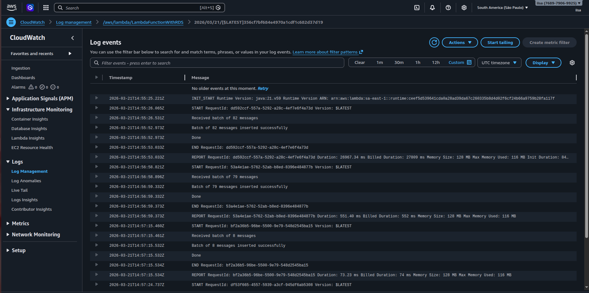

# Arquitetura e Decisões Arquiteturais

## Visão Geral da Arquitetura

O sistema é composto por dois contextos principais: o **Backend Spring Boot** (responsável por receber e enfileirar os dados) e a **Lambda** (responsável por consumir a fila e persistir no banco). A comunicação entre eles é feita de forma assíncrona através do Amazon SQS, garantindo desacoplamento e resiliência.


O fluxo completo segue a seguinte sequência:

```
Sensor → POST /api/telemetria/dados → Backend → SQS → Lambda → RDS PostgreSQL
```

## Componentes

### 1. Sensor (Produtor de Dados)

Representa qualquer dispositivo IoT ou sistema externo que envia dados de telemetria para a aplicação. A comunicação é feita via requisição HTTP POST com payload JSON no seguinte formato:

```json
{
  "sensorId": "sensor-001",
  "temperatura": 25.5,
  "umidade": 60.0,
  "timestamp": "2024-01-01T00:00:00"
}
```

### 2. Backend (Spring Boot + Kotlin)

Responsável por expor o endpoint REST, validar e enfileirar os dados recebidos. Roda dentro de um container Docker, garantindo portabilidade e reprodutibilidade do ambiente.

**Endpoint:** `POST /api/telemetria/dados`

**Fluxo interno:**
1. O `TelemetriaController` recebe o `SensorDataDTO` via `@RequestBody`
2. O `ObjectMapper` serializa o DTO para uma `String` JSON
3. O `SqsService` envia a mensagem para a fila SQS via AWS SDK

**Principais classes:**

| Classe | Responsabilidade |
|---|---|
| `TelemetriaController` | Recebe a requisição HTTP e aciona o serviço |
| `SqsService` | Encapsula a lógica de envio ao SQS |
| `AwsConfig` | Configura o `SqsClient` com credenciais e região |
| `SensorDataDTO` | Representa os dados do sensor |

**Configuração AWS no backend:**

O `SqsClient` é configurado com credenciais e região via variáveis de ambiente, seguindo a prática de não expor credenciais no código:

```kotlin
@Bean
fun sqsClient(): SqsClient {
    val credentials = AwsBasicCredentials.create(accessKey, secretKey)
    return SqsClient.builder()
        .region(Region.of(region))
        .credentialsProvider(StaticCredentialsProvider.create(credentials))
        .build()
}
```

### 3. Amazon SQS (telemetria-queue)

Fila de mensagens gerenciada pela AWS que atua como intermediário entre o backend e a Lambda. É o componente central de desacoplamento da arquitetura.

**Fluxo de mensagem:**
1. Backend envia a mensagem JSON para a fila
2. SQS acumula as mensagens e aciona a Lambda em lotes
3. Lambda confirma o processamento removendo a mensagem da fila

### 4. AWS Lambda (LambdaFunctionWithRDS)

Função serverless acionada automaticamente pelo SQS. Responsável por deserializar as mensagens e persistir os dados no banco em lote. Implementada em Kotlin e empacotada como Shadow JAR.

**Composta por duas classes:**

| Classe | Responsabilidade |
|---|---|
| `TelemetriaConsumer` | Implementa `RequestHandler<SQSEvent, Unit>`, recebe o lote completo e delega ao processor |
| `TelemetriaProcessor` | Gerencia o ciclo de vida da conexão, deserializa os DTOs e executa o batch insert |

**Fluxo interno:**
1. A AWS invoca `TelemetriaConsumer.handleRequest()` com o `SQSEvent`
2. O lote completo de mensagens é passado para `TelemetriaProcessor.processBatch()`
3. O `ObjectMapper` (instância única no `companion object`) deserializa cada mensagem para `SensorDataDTO`
4. Mensagens mal-formatadas são descartadas individualmente com log — sem interromper o batch
5. Uma única conexão JDBC é obtida (reutilizada se warm, criada se cold start)
6. Todos os INSERTs são acumulados via `addBatch()` e executados em um único roundtrip com `executeBatch()`
7. Em caso de falha, o rollback é executado e a conexão é invalidada para forçar reconexão no próximo ciclo

### 5. Amazon RDS PostgreSQL (Banco RDS AWS)

Banco de dados relacional PostgreSQL gerenciado pela AWS, responsável pela persistência dos dados de telemetria.

**Tabela principal:**

```sql
CREATE TABLE sensor_data (
    id          SERIAL PRIMARY KEY,
    sensor_id   VARCHAR(255) NOT NULL,
    temperatura DOUBLE PRECISION NOT NULL,
    umidade     DOUBLE PRECISION NOT NULL,
    timestamp   VARCHAR(255) NOT NULL
);
```

## Decisões Arquiteturais

### Desacoplamento via SQS

**Decisão:** Utilizar o SQS como intermediário entre o backend e a Lambda.

**Justificativa:** Garante que o backend não precise aguardar o processamento e persistência dos dados. Em caso de falha da Lambda, as mensagens permanecem na fila e são reprocessadas automaticamente. Permite que backend e Lambda escalem de forma independente.

### Lambda para Processamento

**Decisão:** Utilizar AWS Lambda para consumir as mensagens e persistir no banco.

**Justificativa:** Modelo serverless elimina a necessidade de gerenciar servidores para o consumidor. A Lambda escala automaticamente conforme o volume de mensagens na fila e o custo é proporcional ao uso.

### Gerenciamento de Conexão sem RDS Proxy (Connection Reuse)

**Decisão:** Reutilizar a conexão JDBC entre invocações da mesma instância Lambda, com validação antes do reuso.

**Justificativa:** O RDS Proxy — serviço gerenciado da AWS que faz pool de conexões — não está disponível no plano free tier. Para obter comportamento equivalente, a conexão é armazenada como estado da instância Lambda e reutilizada enquanto ela permanecer "quente" (warm start). Antes de cada uso, a conexão é validada com `isValid(2)` para detectar timeouts de idle do RDS (~5 minutos). Se inválida, uma nova conexão é criada. Em caso de falha durante o processamento, a conexão é explicitamente invalidada para forçar reconexão no próximo ciclo.

```kotlin
private fun getOrCreateConnection(): Connection {
    val conn = connection
    if (conn != null && !conn.isClosed && conn.isValid(2)) {
        return conn
    }
    return DriverManager.getConnection(formartUrl(endpoint, dbname), usuario, senha).also {
        connection = it
    }
}
```

### Batch Insert via JDBC

**Decisão:** Processar todas as mensagens do lote SQS em um único `executeBatch()` com `autoCommit = false`.

**Justificativa:** Na implementação anterior, cada mensagem gerava uma conexão nova e um INSERT individual — N mensagens resultavam em N roundtrips ao banco. Com o batch insert, todas as mensagens de um evento SQS são acumuladas via `addBatch()` e enviadas ao banco em um único roundtrip. O `autoCommit = false` garante atomicidade: ou todo o lote é persistido, ou nada é — evitando estados parciais em caso de falha.

```kotlin
conn.autoCommit = false
conn.prepareStatement("INSERT INTO sensor_data ...").use { pstmt ->
    for (dto in dtos) {
        pstmt.setString(1, dto.sensorId)
        // ...
        pstmt.addBatch()
    }
    pstmt.executeBatch()
}
conn.commit()
```

### ObjectMapper como Singleton no Companion Object

**Decisão:** Instanciar o `ObjectMapper` uma única vez no `companion object` do `TelemetriaProcessor`.

**Justificativa:** O `ObjectMapper` é thread-safe e custoso para construir — envolve registro de módulos e reflection. Na implementação anterior, uma nova instância era criada a cada mensagem processada. Movê-lo para o `companion object` garante que seja inicializado uma única vez por processo JVM, reduzindo overhead de CPU e memória em cada invocação.

```kotlin
companion object {
    private val mapper = ObjectMapper().registerKotlinModule()
}
```

### Isolamento de Falhas por Mensagem no Parsing

**Decisão:** Capturar exceções de desserialização individualmente por mensagem, descartando apenas a mensagem problemática sem interromper o batch.

**Justificativa:** Uma mensagem mal-formatada não deve comprometer o processamento das demais mensagens do lote. A falha é logada com o `messageId` para rastreabilidade e a mensagem é descartada. Esta abordagem pode ser evoluída para reencaminhar a mensagem para uma Dead Letter Queue (DLQ) caso seja necessário maior garantia de entrega.


## Evidências do Fluxo (CloudWatch)

Os logs do **Amazon CloudWatch** registram cada execução da Lambda, evidenciando o fluxo completo de processamento das mensagens SQS e persistência no banco RDS.



### Logs Observados

Os logs abaixo foram capturados durante a execução dos testes de carga com k6, onde 5.961 mensagens foram enviadas para a fila SQS e processadas em lotes pela Lambda:

| Timestamp | Evento | Detalhe |
|---|---|---|
| 14:55:25 | `INIT_START` | Inicialização do runtime Java 21 (cold start) |
| 14:55:26 | `START` | Início da execução da Lambda |
| 14:55:26 | Recebimento | Lote de **82 mensagens** recebido do SQS |
| 14:55:52 | Inserção | **82 mensagens inseridas com sucesso** no RDS |
| 14:55:53 | `END` + `REPORT` | Duração: **26.967ms**|
| 14:56:58 | Recebimento | Lote de **79 mensagens** recebido do SQS |
| 14:56:59 | Inserção | **79 mensagens inseridas com sucesso** no RDS |
| 14:56:59 | `END` + `REPORT` | Duração: **551ms** — Execução quente |
| 14:57:15 | Recebimento | Lote de **8 mensagens** recebido do SQS |

### Análise dos Resultados

**Processamento em lote:**

O SQS entregou as mensagens em lotes de tamanhos variados (82, 79) comportamento esperado do serviço que agrupa mensagens conforme disponibilidade e configuração do batch size. Todos os lotes foram processados e inseridos com sucesso, com **0 erros** registrados.

**Memória:**

O consumo de memória se manteve estável em **116 MB**  dentro do limite configurado de 128 MB, indicando que o tamanho da instância está adequado para o volume de mensagens processado.
     