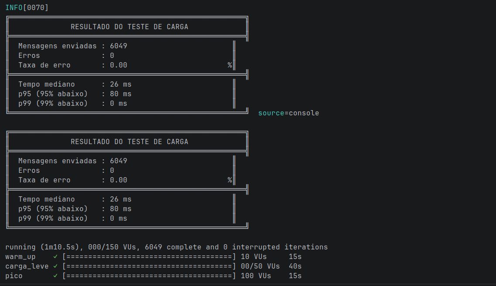
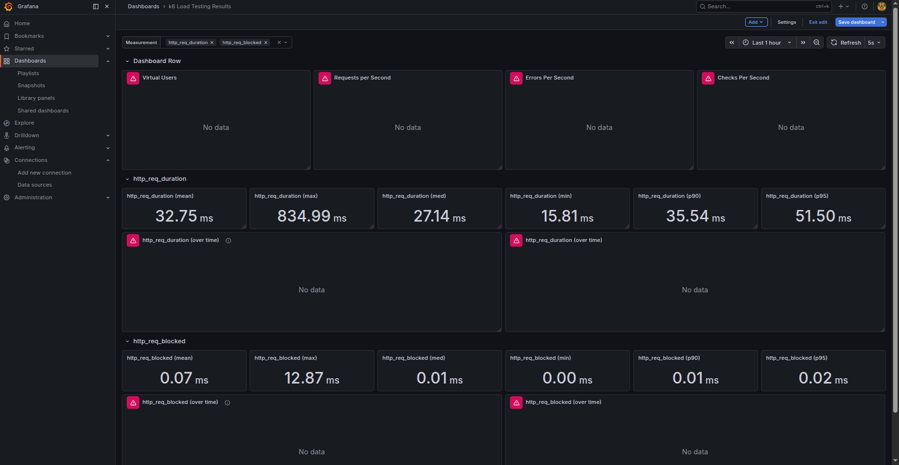

# Testes de Carga

Os testes de carga têm como objetivo avaliar o comportamento da aplicação sob diferentes níveis de pressão, garantindo que a arquitetura seja capaz de escalar de forma eficiente e manter a estabilidade mesmo em cenários de alta demanda.

## Ferramentas e Infraestrutura

| Ferramenta | Finalidade |
|---|---|
| k6 | Execução e orquestração dos cenários de carga |

## Script de Teste

O script `load-test.js` está localizado em `load-test/load-test.js` e implementa três cenários sequenciais com métricas customizadas.

### Estrutura do payload

Cada requisição simula um sensor IoT enviando dados reais com valores aleatórios dentro de faixas realistas:

```javascript
{
  sensorId:    "sensor-001",          // 4 sensores distintos em rotação
  temperatura: 25.4,                  // 10°C a 50°C
  umidade:     63.2,                  // 20% a 80%
  timestamp:   "2024-01-01T00:00:00"
}
```

## Cenários

```
Tempo →  0s     15s          55s     70s
         │       │            │       │
         ├─ Warm-up ─┤        │       │
         │  10 VUs   │        │       │
                     ├─ Carga Leve ──┤├─ Pico ─┤
                     │  10 → 50 VUs  ││ 100 VUs│
```

### 1. Warm-up (0s – 15s)

- **VUs:** 10 constantes
- **Objetivo:** Provocar o cold start da Lambda, abrir a primeira conexão com o RDS e validar conectividade end-to-end
- **O que observar:** Latência elevada na primeira requisição (cold start ~800ms) seguida de queda para valores estáveis

### 2. Carga Leve (15s – 55s)

- **VUs:** Rampa de 10 → 50 → 0
- **Objetivo:** Validar o batch insert e a reutilização de conexão em warm start com volume crescente
- **O que observar:** Mediana de latência estável (< 50ms), sem crescimento de conexões abertas no RDS, `executeBatch()` agrupando múltiplas mensagens por invocação

### 3. Pico (55s – 70s)

- **VUs:** 100 constantes
- **Objetivo:** Verificar que a Reserved Concurrency da Lambda limita as conexões simultâneas no RDS mesmo sob rajada intensa
- **O que observar:** Fila SQS absorve o excesso, Lambda processa em lotes, `DatabaseConnections` no RDS permanece dentro do limite configurado

## Thresholds

Os thresholds definem os critérios de aprovação/reprovação do teste:

| Métrica | Threshold | Justificativa |
|---|---|---|
| `http_req_duration` | p(95) < 3000ms | 95% das requisições devem responder em menos de 3s |
| `taxa_erros` | rate < 0.05 | Menos de 5% de erros tolerados |
| `mensagens_com_erro` | count < 25 | Teto absoluto de 25 falhas no total do teste |

## Métricas Customizadas

Além das métricas nativas do k6, o script coleta métricas específicas do domínio:

| Métrica | Tipo | Descrição |
|---|---|---|
| `mensagens_enviadas` | Counter | Total acumulado de mensagens enviadas com sucesso |
| `mensagens_com_erro` | Counter | Total acumulado de mensagens com falha |
| `taxa_erros` | Rate | Proporção de erros por requisição (0.0 a 1.0) |
| `tempo_por_requisicao` | Trend | Distribuição de latência (mediana, p90, p95, p99) |


## Resultados Obtidos

### Execução do Teste (terminal k6)



O teste executou **6.049 iterações** em **1m10,5s**, passando pelas três fases sem nenhuma
interrupção. As barras de progresso confirmam que cada cenário completou exatamente dentro
do tempo e VUs configurados:

### Métricas em Tempo Real (Grafana + InfluxDB)



O Grafana exibe os valores calculados sobre a série temporal completa armazenada no InfluxDB,
complementando o resumo do terminal com média, mínimo e máximo absolutos:

| Métrica | Valor | Avaliação |
|---|---|---|
| Média (`mean`) | 32,75ms | ✅ Próxima da mediana — distribuição estável |
| Máximo (`max`) | 834,99ms | ⚠️ Cold start da primeira invocação |
| Mediana (`med`) | 27,14ms | ✅ Baseline saudável pós warm-up |
| Mínimo (`min`) | 15,81ms | ✅ Melhor caso em warm start pleno |
| p90 | 35,54ms | ✅ 90% das requisições abaixo de 36ms |
| p95 | 51,50ms | ✅ Abaixo do threshold de 3000ms |

### Análise dos Resultados

#### Cold start (834,99ms)

O pico de **834,99ms** corresponde à primeira invocação da Lambda durante o warm-up, quando
a conexão com o RDS ainda não existe. Após esse estabelecimento inicial, a conexão é reutilizada
entre invocações, e a latência cai para mediana de **27ms** — uma redução de aproximadamente
**97%**. Isso confirma a eficácia da estratégia de connection reuse como substituto ao RDS Proxy.

#### Estabilidade da distribuição

A proximidade entre **média (32,75ms)** e **mediana (27ms)** indica distribuição sem outliers
frequentes — o cold start elevou a média pontualmente, mas não distorceu o comportamento geral.
A diferença entre p90 (35ms) e p95 (51ms) também é pequena, sinalizando que mesmo os casos
mais lentos permanecem bem dentro dos limites aceitáveis.   

## Conclusão

Os testes de carga demonstram que a aplicação é capaz de manter baixo tempo de resposta, alta estabilidade e controle eficiente de recursos, mesmo sob condições de pico.

Além disso, os resultados validam a decisão arquitetural de substituir o RDS Proxy pela estratégia de connection reuse, que se mostrou eficaz na redução de latência e no controle do número de conexões abertas.